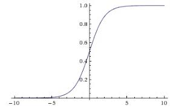

# 机器学习部分算法笔记与实现
简单描述几个算法的原理和适用范围总结（大部分来自*Machine Learning in Action -- **Peter Harrington***），并附基本的实现代码。

---
## 目录
- 监督学习
    1. [k近邻](https://github.com/HauWong/Machine_Learning_Practice#k%E8%BF%91%E9%82%BB) *[knn.py](py_files/knn.py)*
    2. [决策树](https://github.com/HauWong/Machine_Learning_Practice#%E5%86%B3%E7%AD%96%E6%A0%91) *[decision_tree.py](py_files/decision_tree.py)*
    3. [朴素贝叶斯分类](https://github.com/HauWong/Machine_Learning_Practice#%E6%9C%B4%E7%B4%A0%E8%B4%9D%E5%8F%B6%E6%96%AF%E5%88%86%E7%B1%BB) *[bayes.py](py_files/bayes.py)*
    4. [极大似然法](https://github.com/HauWong/Machine_Learning_Practice#%E6%9E%81%E5%A4%A7%E4%BC%BC%E7%84%B6%E6%B3%95)
    5. [Logistic回归](https://github.com/HauWong/Machine_Learning_Practice#%E9%80%BB%E8%BE%91logistic%E5%9B%9E%E5%BD%92) *[logistic_regression.py](py_files/logistic_regression.py)*
    6. [支持向量机](https://github.com/HauWong/Machine_Learning_Practice#%E6%94%AF%E6%8C%81%E5%90%91%E9%87%8F%E6%9C%BA)
- 无监督学习
	- 聚类
	  1. [K-Means](https://github.com/HauWong/Machine_Learning_Practice#k-means) *[kmeans](cpp_files/kmeans)*
	- 降维
	  1. [主成分分析(PCA)](https://github.com/HauWong/Machine_Learning_Practice#%E4%B8%BB%E6%88%90%E5%88%86%E5%88%86%E6%9E%90pca) *[pca.py](py_files/pca.py)*

## k近邻
存在一个样本数据集合，也称作训练样本集，并且样本集中每个数据都具有唯一标签即所属类别，和对应特征。输入一个类别未知的新数据后，将新数据的特征与样本集中数据对应的特征进行比较，选择样本数据集中前k个与新数据特征最相近的数据，选择k个数据中出现次数最多的分类作为新数据的类别。  

> - 优点：精度高、对异常值不敏感、无数据输入假定；
> - 缺点：计算复杂度高、空间复杂度高；
> - 适用数据：数值型、标称型。
## 决策树
确定一个生物是否是鱼时，可能会先根据“在水下是否能生活”、“是否有脚蹼”两种特征来判断，比如首先判断“在水下是否能生活”，如果“否”则该生物一定不是鱼，如果“是”则判断“是否有脚蹼”，如果“是”则一定不是鱼，如果“否”则是鱼。以上过程即一个简单的决策树的分类过程。   

在构建决策树时，需要根据给定的数据集确定特征判断的次序，如上述先判断“水下是否能生活”再判断“是否有脚蹼”，而确定哪种特征优先的过程要用到“熵”。首先计算根据不同的特征划分数据集时信息增益的变化，即熵的变化，选择使信息增益最高的特征作为当先划分数据集的最优特征；然后分别针对划分后的多个子数据集判断增益，如果当前子数据集完全属于同类，则当前分支结束，继续在其他子数据集中寻找使信息增益最高的特征，即重复上步过程，直至稳定；此时已构建好决策树。  
=-\sum_{i=1}^np(x_i)\log{p(x_i)})

> - 优点：计算复杂度不高，输出结果易于理解，对中间值的缺失不敏感，可以处理不相关特征数据；
> - 缺点：易产生过拟合问题；
> - 适用数据：数值型（需要离散化）、标称型。

## 朴素贝叶斯分类
贝叶斯分类的核心思想为：在已知先验概率的情况下，计算数据属于某类别的后验概率，用 *p1* 表示数据属于类别1的概率，*p2* 表示数据属于类别2的概率，若 *p1*>*p2* 则为类别1，若 *p2*>*p1* 则为类别2。那么如何得到 *p1* 和 *p2* 呢？答案是通过贝叶斯公式。    

=\frac{P(B|C)P(C)}{P(B)})

概念解释：  
> - **先验概率**：通过数据统计直接可得的概率分布，如上式中的*P(B)*和*P(C)*；  
> - **后验概率**：在已知条件下获得某项数据的概率，所以也称为条件概率，如上式中的*P(C|B)*。

而“朴素”即要求数据满足“**各特征之间是条件独立**”这一基本假设。在“特征条件独立”的基本假设下，贝叶斯公式中已知类别计算特征的后验概率（上式中*P(B|C)* ）就简单了许多。首先计算在数据中属于某类别的情况下各特征值的频率（数据量很大时，频率可以近似等于概率），再计算它们的联合分布即得到*P(B|C)*；然后分别计算某类别的先验概率*P(C)* ；从贝叶斯公式中可以看出，对于不同的类别后验概率计算过程，概率*P(B)* 始终保持一致，即只需对比*P(B|C)P(C)* 的值便能代表后验概率*P(C|B)* 的相对大小。

> - 优点：算法简单，易实现;
> - 缺点：实际情况下往往难以满足“特征间相互独立”的朴素假设，使分类效果不好；
> - 适用数据：标称型。

## 极大似然法

极大似然法也是一种利用概率进行估计的方法，估计的目标是似然函数的参数，而得到的参数使似然函数能完成分类或回归任务。
极大似然法也有一个假设即“**所有样本均是独立同分布**”。

如何确定参数呢？当前问题是“已知数据分布和先验数据，但分布模型的参数未知”，而极大似然法认为最佳参数应该是利用先验数据求得似然最大时的参数。

概念解释：
> - **似然**：类似于概率，表示事件有多大的可能性发生。比如对于})，如果模型参数已确定，而是变量，则称其为概率，表示对于不同的样本，出现的概率是多少；如果确定，而是变量，则称其为似然，表示对于不同的参数，当前样本的概率是多少。

假设样本集（先验数据）中的样本均为独立同分布，已知其分布的概率密度函数为，则对于参数来说，产生所有样本的联合概率分布为：

=f(x_i|\theta)\times{f(x_2|\theta)\times...\times{f(x_n|\theta)}})

因此似然函数可以表示为：

=f(x_1,...,x_n|\theta)=\prod_{i=1}^nf(x_i|\theta))

通过求导便可获得最大似然时对应的参数，由于连乘操作会使似然值很小，因此为了便于计算，通常会对似然函数取对数，即得到如下对数似然形式：

}=\sum_{i=1}^n\ln{f(x_i|\theta)})

因此，最终转变成求解如下值：

})

## 逻辑(Logistic)回归
首先要明确一点，尽管名字中带有“回归”二字，但逻辑回归实际上是一种二分类算法而不是回归算法。二分类是指输出结果非0即1，一般用以判断某事物的两种可能性，比如是否患病、是否正确等。要实现二分类，Logistic回归引入Sigmoid函数，Sigmoid函数是一个S形曲线，如图所示，其值介于0和1之间。一般，当其函数值大于0.5时，便将其分为1类；若其值小于0.5，则分为0类。  

=\frac{1}{1+e^{-z}})

  
关键在于如何由给定数据的特征向量得到上式中的。对于一般的二分类任务，通常会给定数据的特征向量，包含多种特征，Sigmoid函数中的输入，由参数向量与特征向量相乘得到，即，其中参数等通过训练获得。训练方法有多种可选，如梯度下降法。
> **梯度下降法**  
- 损失函数：训练的目的是获得能使样本的预测结果与真实值尽量接近的一组参数，而预测结果与真实值之间的差别通常称之为损失，因此计算损失的函数便是损失函数，计算全体样本平均损失的函数通常称为代价函数。  
- 梯度下降：为了使损失值最小，需要在训练过程中对参数进行修正，使其向损失值快速变小的方向更新，即梯度下降的方向，最终会达到损失函数的局部最小值，此时获得的参数即局部最优参数。  

逻辑回归算法常用的损失函数比如交叉熵函数（如下），其中 ***o*** 表示真值，***y*** 表示预测值，详细讲解见[知乎文章](https://zhuanlan.zhihu.com/p/38241764)。  

=-(o\log{y}+(1-o)\log{1-y}))

其梯度计算公式如下，其中 ***h*** 表示当前权重对应的特征值。  

=-[\frac{o-y}{y(1-y)}\cdot{y'}]=(y-o)h)  

> 备注：  
> 1. 逻辑回归与线性回归的关系：逻辑回归不是回归算法，其假设数据服从伯努利分布，而线性回归是一种回归算法，其假设数据服从高斯分布。实际上，若去除Sigmoid函数部分，逻辑回归也是最简单的线性回归，但其经过Sigmoid转换后，对结果进行了二分类，便是一种分类算法。  
> 2. 在神经网络研究中，Sigmoid函数也称为一种激活函数，其目的是使层输出结果非线性化。

> - 优点：计算成本低、易于理解和实现；
> - 缺点：容易欠拟合而导致精度不高；
> - 使用数据：数值型和标称型。

## 支持向量机
对于线性可分的数据，支持向量机(Support Vector Machine, SVM)是将他们分开的一条直线（或者称为超平面），而这条直线并不普通，它要保证与数据间存在最大间隔。因此，SVM的目的就是找到一个超平面，使给定数据点离该超平面尽量远即分为两步1.找到距离超平面最近的点即支持向量，2.使该点与超平面的距离尽可能地大。

**1. 间隔**  
假设数据集线性可分，则超平面的表达式可以表示为，其中和即待求参数。得到二者后，即可通过)获得对应的类别标签。
既然要衡量距离，则有一个很重要的概念即间隔，在SVM算法中有两种间隔，如下：
> - 函数间隔：)  
> - 几何间隔：}{||w||})  

**2. 凸优化问题**  
从两种间隔的形式可以看出，一旦超平面确定，则和可以等比例缩放，但此时函数间隔会发生变化，而几何间隔不会变，因此选用几何间隔作为衡量数据点到超平面距离的标更加合理。既然函数间隔可以缩放，那为了计算方便，不妨令\geq{1})，此时欲得到取得最近数据点的最大几何间隔}{||w||})时的和，即求。稍加转化，可将其转换为如下形式：

\geq{1},i=1,2,...,n)

**3. 拉格朗日算子优化**  
上述形式为带有约束条件的凸优化问题，采用拉格朗日乘子法进行优化，即可转换为：

,\alpha\geq{0}})

其中，)即由上述优化问题得到的拉格朗日函数，形式为：

=\frac{1}{2}||w||^2-\sum_{i=1}^n\alpha_i(y_i(w^Tx_i+b)-1),s.t.\alpha_i\geq{0})

> 此处对上述最大化拉格朗日函数值进行解释，由前面知，该凸优化问题的约束条件为\geq{1},i=1,2,...,n)，则-1\geq{0})，此时-1),s.t.\alpha_i\geq{0})最小值为0，即)刚好等于。

通过从上述还是很难求得和。由于原问题为二次凸优化问题，且约束条件为线性条件，因此满足KKT条件（可以证明），可以转化为与原问题具有强对偶关系的对偶问题。

> **KKT条件**
>   
> ， ， ，  
> 
> -1)=0,s.t.\alpha_i\geq{0})， 
>  
> \geq{1})

最终可转化为对偶问题：

,s.t.\alpha\geq{0}})

此时可先对求偏导，可得，将其代入)再对求偏导，得到。因此最优化问题转化为：

，也就是

。
求得最优解后，可以根据上述求导结果和KKT条件得到  
  

> 此处对支持向量进行解释，从KKT条件中的第四个等式（称为松弛互补条件）可以看出，当-1={0})时，数据点刚好位于距离决策面最近的位置，松弛互补条件会始终满足，这些数据点即支持向量；当-1>{0})时，此时数据点距离分隔面更远（相比于支持向量），此时要想满足松弛条件，则要求，因此实际上在SVM分类器中发挥作用的只有支持向量，其他数据点对决策面没有影响。

**4. 松弛变量**  
理想情况下，数据可以通过一个超平面完美地分隔开，但实际情况总是存在一些变异点，使其函数距离小于1，因此引入松弛变量（类似于为决策面建立了一个缓冲区，使一些函数距离小于1的点也能被正确归类），加入松弛变量后的优化函数变为以下形式：

\geq{1-\xi_i},\xi_i\geq{0},i=1,2,...,n)

**5. 核函数**  
即便引入松弛变量，数据集可能也无法完美地线性可分，说明数据本身就是线性不可分的。若数据非线性可分，则我们可以将其在更高的维度表达，使其再新的维度中线性可分，从上述最优化求解过程可以看出，最终的最优化问题唯一与数据相关的一项为内积过程，即，若将先数据表达为高维度形式，再进行内积操作的话，无疑随着数据原始维度的增加，该过程将非常复杂，且可能出现转化后为无限维的情况。而核函数的作用是，不必先在高维空间中表达数据后作内积，直接计算原始数据得到与高维空间中的内积相似的结果。

> **常见的核函数**   
>
> 1. 线性核：线性核实际上就是上述所做的原始内积，用于数据是线性可分的情况，参数少速度快，一般作为首先尝试选择，若效果理想则直接使用线性核函数。  
> =\langle{x_i,x}\rangle)  
>
> 2. 多项式核：得到的结果与先将数据表达至高维空间后再进行内积的结果一致，参数较多，随着原始空间数据维度的增加，计算会愈加复杂。  
> =((x\cdot{x_i})+1)^d)
>   
> 3. 高斯径向基核：高斯径向基函数是一种局部性强的核函数，其可以将一个样本映射到一个更高维的空间内，该核函数是应用最广的一个，无论大样本还是小样本都有比较好的性能，而且其相对于多项式核函数参数要少，因此大多数情况下在不知道用什么核函数的时候，优先使用高斯核函数（摘自[CSDN博文](https://blog.csdn.net/batuwuhanpei/article/details/52354822)）。   
> =\exp(-\frac{||x-x_i^2||^2}{\delta^2}))

SVM特点
> - 优点：准确率高，计算成本低；
> - 缺点：对参数敏感；
> - 适用数据：数值型和标称型。

## K-Means
KMeans是一种常见的聚类算法，其目的是对给定的数据集，依据距离对其进行划分，最终得到K个不同的簇（组），具体过程如下。
> 1. 首先随机设定K个簇初始的质心；
> 2. 计算所有数据与K个簇质心的距离，将数据分配至与其距离最近的簇中；
> 3. 分配完成后，重新计算每个簇的质心；
> 4. 如果新的质心与之前质心的变化超过阈值则重复第2、3步，直至质心位置稳定，即得到最终K个簇，完成聚类。  

Kmeans特点
> - 优点：易实现；
> - 缺点：会出现收敛至局部最小值的情况（取决于初始质心），对大规模数据集收敛较慢；
> - 适用数据：数值型。

## 主成分分析(PCA)
PCA是一种常见的降维算法，其目标是寻找一组向量，使数据集可以投影到这一组向量所形成的空间中，得到对数据集低维度的表达。通常我们习惯使用矩阵来表示数据集，每一条数据是一个Nx1的向量，N即数据的原始维度，如果有M条数据，则该数据集可以表达为一个NxM的矩阵 **A** ，要将该数据集降维表达，即在新的维度K<N来表示，将得到维度为KxM的新的数据集矩阵 **B** 。实现过程将用到矩阵中的一些概念。  

我们在矩阵分析中学过**基**的概念，对于给定的向量组（用矩阵 **A** 表示），通常存在一组线性无关的向量（用矩阵 **D** 表示），使 **A** 中所有向量都可以用这一组向量的线性组合表示，而这一组线性无关的向量即矩阵 **A** 的一组基，线性组合的过程即 **D**x**A**=**B** ，**B** 的列向量即 **A** 中向量在每一个基上的投影。在上述矩阵中，矩阵 **A** 大小为NxM，矩阵 **D** 大小为KxN (K<=N)，其中N表示原始数据维度，M表示数据量，K表示变换后的维度，如果K<N，则实现了降维。  

上述矩阵变换过程便是降维的过程，然而，数据量M通常远大于原始维度N，所以往往会是K=N的情况，此时需要从所有基向量中选择部分基进行降维，但这往往意味着信息损失，因此若想在降维的同时尽可能多地保留信息，便需要分析这些基中主要的向量，即主成分分析。  

现在知道了主成分分析的目的是选择合适的基向量使降维过程尽量减少信息损失，这在上述向量投影的理论中可以描述为使投影后的数据尽量分散（我的理解：如果过于密集则实际上说明将多个数据相似描述了，即信息损失较大），即投影后的数据方差尽量大。对于降维维数K大于1的情况下，不能只考虑各基向量的方差，同时需要考虑两个基向量将数据降维后数据要尽可能分散，即二者不相关，也即二者协方差为0，在线性代数中称它们为正交基。此时，**PCA的目标是找到给定数据集的K<N个正交基，且要求经此K个基变换后得到的方差最大，将数据集投影到这一组正交基上便实现对数据集的降维表达。** 从矩阵角度来思考，即寻找使矩阵 **A** 的协方差矩阵对角化且按方差从大到小排列的矩阵 **P** ，前K行即目标基向量，这一问题最终转化为计算协方差矩阵的特征值和特征向量。

> - 优点：可降低数据复杂性；
> - 缺点：会损失信息；
> - 适用数据：数值型。