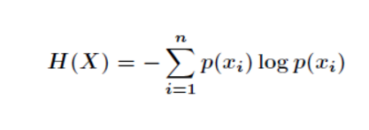
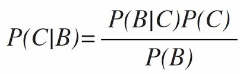

# 机器学习部分算法笔记与实现
简单描述几个算法的原理和适用范围总结（部分来自*Machine Learning in Action -- **Peter Harrington***），并附基本的实现代码。

---
## 目录
- 监督学习
    1. [k近邻](https://github.com/HauWong/Machine_Learning_Practice#k%E8%BF%91%E9%82%BB) *[knn.py](https://github.com/HauWong/Machine_Learning_Practice/blob/master/py_files/knn.py)*
    2. [决策树](https://github.com/HauWong/Machine_Learning_Practice#%E5%86%B3%E7%AD%96%E6%A0%91) *[decision_tree.py](https://github.com/HauWong/Machine_Learning_Practice/blob/master/py_files/decision_tree.py)*
    3. 朴素贝叶斯分类
    4. 支持向量机
- 无监督学习
	- 聚类
	  1. [K-Means](https://github.com/HauWong/Machine_Learning_Practice#k-means) *[kmeans](https://github.com/HauWong/Machine_Learning_Practice/tree/master/cpp_files/kmeans)*
	- 降维
	  1. [主成分分析(PCA)](https://github.com/HauWong/Machine_Learning_Practice#%E4%B8%BB%E6%88%90%E5%88%86%E5%88%86%E6%9E%90pca) *[pca.py](https://github.com/HauWong/Machine_Learning_Practice/blob/master/py_files/pca.py)*

## k近邻
> 存在一个样本数据集合，也称作训练样本集，并且样本集中每个数据都具有唯一标签即所属类别，和对应特征。输入一个类别未知的新数据后，将新数据的特征与样本集中数据对应的特征进行比较，选择样本数据集中前k个与新数据特征最相近的数据，选择k个数据中出现次数最多的分类作为新数据的类别。  

> - 优点：精度高、对异常值不敏感、无数据输入假定；
> - 缺点：计算复杂度高、空间复杂度高；
> - 适用数据：数值型、标称型。
## 决策树
> 确定一个生物是否是鱼时，可能会先根据“在水下是否能生活”、“是否有脚蹼”两种特征来判断，比如首先判断“在水下是否能生活”，如果“否”则该生物一定不是鱼，如果“是”则判断“是否有脚蹼”，如果“是”则一定不是鱼，如果“否”则是鱼。以上过程即一个简单的决策树的分类过程。   
> 
> 在构建决策树时，需要根据给定的数据集确定特征判断的次序，如上述先判断“水下是否能生活”再判断“是否有脚蹼”，而确定哪种特征优先的过程要用到“熵”。首先计算根据不同的特征划分数据集时信息增益的变化，即熵的变化，选择使信息增益最高的特征作为当先划分数据集的最优特征；然后分别针对划分后的多个子数据集判断增益，如果当前子数据集完全属于同类，则当前分支结束，继续在其他子数据集中寻找使信息增益最高的特征，即重复上步过程，直至稳定；此时已构建好决策树。  

> - 优点：计算复杂度不高，输出结果易于理解，对中间值的缺失不敏感，可以处理不相关特征数据；
> - 缺点：易产生过拟合问题；
> - 适用数据：数值型（需要离散化）、标称型。

## 朴素贝叶斯分类
> 贝叶斯分类的核心思想为：在已知先验概率的情况下，计算数据属于某类别的后验概率，用*p1*表示数据属于类别1的概率，*p2*表示数据属于类别2的概率，若*p1*>*p2*则为类别1，若*p2*>*p1*则为类别2。那么如何得到*p1*和*p2*呢？答案是通过贝叶斯公式。    
>   
> 概念解释：  
> - **先验概率**：通过数据统计直接可得的概率分布，如上式中的*P(B)*和*P(C)*；  
> - **后验概率**：在已知条件下获得某项数据的概率，所以也称为条件概率，如上式中的*P(C|B)*和*P(B|C)*。
> 
> 而“朴素”即要求数据满足“**各特征之间是条件独立**”这一基本假设。在“特征条件独立”的基本假设下，贝叶斯公式中已知类别计算特征的后验概率（上式中*P(B|C)*）就简单了许多。首先计算在数据中属于某类别的情况下各特征值的频率（数据量很大时，频率可以近似等于概率），再计算它们的联合分布即得到*P(B|C)*；然后分别计算某类别的先验概率*P(C)*；从贝叶斯公式中可以看出，对于不同的类别后验概率计算过程，概率*P(B)*始终保持一致，即只需对比*P(B|C)P(C)*的值便能带表后验概率*P(C|B)*的相对大小。

> - 优点：算法简单，易实现;
> - 缺点：实际情况下往往难以满足“特征间相互独立”的朴素假设，使分类效果不好；
> - 适用数据：标称型。

## 支持向量机
> 对于线性可分的数据，支持向量机(Support Vector Machine, SVM)是将他们分开的一条直线（或者称为超平面），而这条直线并不普通，它要保证与数据间存在最大间隔。因此，SVM的目的就是找到一个超平面，使给定数据点离该超平面尽量远即分为两步1.找到距离超平面最近的点即支持向量，2.使该点与超平面的距离尽可能地大。

## K-Means
> KMeans是一种常见的聚类算法，其目的是对给定的数据集，依据距离对其进行划分，最终得到K个不同的簇（组），具体过程如下。
> 1. 首先随机设定K个簇初始的质心；
> 2. 计算所有数据与K个簇质心的距离，将数据分配至与其距离最近的簇中；
> 3. 分配完成后，重新计算每个簇的质心；
> 4. 如果新的质心与之前质心的变化超过阈值则重复第2、3步，直至质心位置稳定，即得到最终K个簇，完成聚类。

> - 优点：易实现；
> - 缺点：会出现收敛至局部最小值的情况（取决于初始质心），对大规模数据集收敛较慢；
> - 适用数据：数值型。

## 主成分分析(PCA)
> PCA是一种常见的降维算法，其目标是寻找一组向量，使数据集可以投影到这一组向量所形成的空间中，得到对数据集低维度的表达。通常我们习惯使用矩阵来表示数据集，每一条数据是一个Nx1的向量，N即数据的原始维度，如果有M条数据，则该数据集可以表达为一个NxM的矩阵 **A** ，要将该数据集降维表达，即在新的维度K<N来表示，将得到维度为KxM的新的数据集矩阵 **B** 。实现过程将用到矩阵中的一些概念。  
> 
> 我们在矩阵分析中学过**基**的概念，对于给定的向量组（用矩阵 **A** 表示），通常存在一组线性无关的向量（用矩阵 **D** 表示），使 **A** 中所有向量都可以用这一组向量的线性组合表示，而这一组线性无关的向量即矩阵 **A** 的一组基，线性组合的过程即 **D**x**A**=**B** ，**B** 的列向量即 **A** 中向量在每一个基上的投影。在上述矩阵中，矩阵 **A** 大小为NxM，矩阵 **D** 大小为KxN (K<=N)，其中N表示原始数据维度，M表示数据量，K表示变换后的维度，如果K<N，则实现了降维。  
> 
> 上述矩阵变换过程便是降维的过程，然而，数据量M通常远大于原始维度N，所以往往会是K=N的情况，此时需要从所有基向量中选择部分基进行降维，但这往往意味着信息损失，因此若想在降维的同时尽可能多地保留信息，便需要分析这些基中主要的向量，即主成分分析。  
> 
> 现在知道了主成分分析的目的是选择合适的基向量使降维过程尽量减少信息损失，这在上述向量投影的理论中可以描述为使投影后的数据尽量分散（我的理解：如果过于密集则实际上说明将多个数据相似描述了，即信息损失较大），即投影后的数据方差尽量大。对于降维维数K大于1的情况下，不能只考虑各基向量的方差，同时需要考虑两个基向量将数据降维后数据要尽可能分散，即二者不相关，也即二者协方差为0，在线性代数中称它们为正交基。此时，**PCA的目标是找到给定数据集的K<N个正交基，且要求经此K个基变换后得到的方差最大，将数据集投影到这一组正交基上便实现对数据集的降维表达。** 从矩阵角度来思考，即寻找使矩阵 **A** 的协方差矩阵对角化且按方差从大到小排列的矩阵 **P** ，前K行即目标基向量，这一问题最终转化为计算协方差矩阵的特征值和特征向量。

> - 优点：可降低数据复杂性；
> - 缺点：会损失信息；
> - 适用数据：数值型。